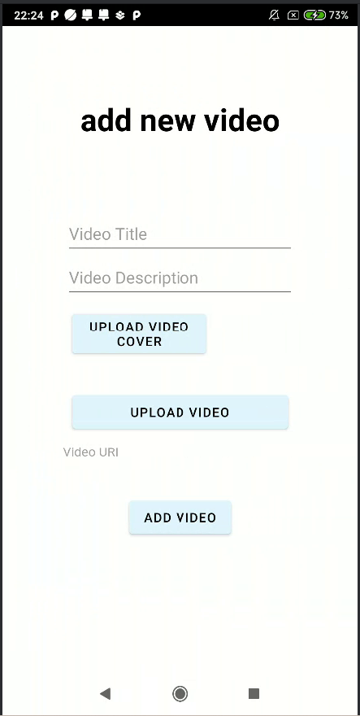
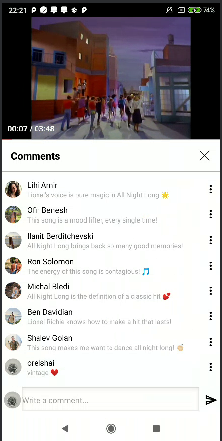

# UniTube

UniTube is an Android application that allows users to upload, view, and manage videos.
Users can register, log in, add videos, like, dislike and comment on videos.
This README provides an overview of the project's features, setup instructions, and usage guidelines.

## Running the Application

1. Clone the repository to your local machine.
2. Open the project in Android Studio.
3. Connect your Android device or start an emulator.
4. Build and run the app on your device or emulator.

## About the App

The name "UniTube" is a fusion of two key concepts: "University" and "YouTube", each contributing to the essence of our video-sharing platform.

## Features

- ### Sign up
- All fields must be filled. all validation conditions displayed under the fields must be met.
  Allows users to create a new account with username, password, password confirmation, display name, and upload profile picture.

  
  

- ### Login Screen
  Provides a simple login form where users can enter their username and password to access the application.
  The user must enter the details with which they signed up; otherwise, they will receive a message that the user does not exist.

  
  

- ### Home Page
  The Home Page is the starting point of the application where users can view a list of videos.
  Users do not need to log in to access the Home Page.
  If users log in, they will be able to add, edit, and delete comments and videos, as well as like and dislike videos.

  

- ### Add a New Video
  Adding a new video can be done through the "Add Video" button. Only logged-in users can add new videos.
  Enter title and description. select an image as the video thumbnail and video file to upload.
  the video will be displayed on the home page after uploading.

  
  

- ### View Video Page
  Shows detailed information of a selected video, including title, description, video player, and interactive buttons like Like, Share, Comment with options to add, edit, and delete comments. Only logged-in users can add, edit, and delete comments, as well as edit the video and its details. Additionally, logged-in users can like or dislike a video.

  
  
  

### Interact with videos - Like, Dislike, Comment, Edit and Delete

- Editing and deleting videos and comments can only be done if you are logged in. These actions are available on the video viewing page.
  
  

- Liked post (The like sign turns dark, and the number of likes increases):
  

- Only logged-in users can add, edit, and delete comments.
  

- ### Sidebar and Greeting
  The sidebar allows navigation through the app, including logging out. The greeting changes based on user status.

  
  

- ### Dark Mode
Toggle to night mode for a dark-themed interface. the dark mode can be toggled on and off from the bottom menu.

  
  

- ### Log Out
  Logging out can be done through the menu, by clicking on the log out button. logging out will take the user back to the login page.

## Project Structure

The project structure includes the following key components:

- **MainActivity**: The home page with videos.
- **LoginScreen**: Handles user login.
- **RegisterScreen**: Handles user registration.
- **AddVideoScreen**: Allows users to upload videos.
- **VideoPlayActivity**: Displays video details, including title, description, and video player.
- **UploadPhotoHandler**: Contains functions to assist with photo uploads.
- **UploadVideoHandler**: Handles video uploading functionality.
- **VideoManager**: Manages video loading and other video-related operations.
- **Comment**: A class representing comments on videos.
- **User**: A class representing user information, including profile picture and username.
- **Video**: A class representing video information, including title, description, and video file.
